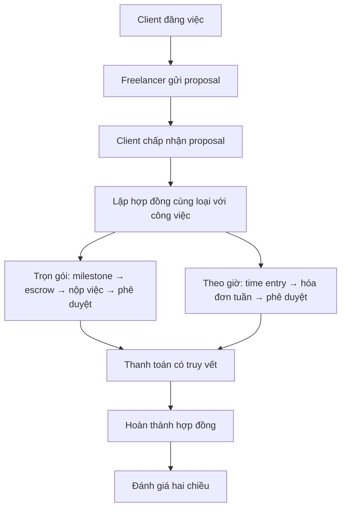

# Mini-Upwork · Distributed Database Project

Đồ án cơ sở dữ liệu của **nhóm Rum**, mô hình hóa nền tảng kết nối khách hàng và freelancer: đăng việc, gửi đề xuất, lập hợp đồng, theo dõi công việc, thanh toán và đánh giá hai chiều.

> **Trạng thái: lập kế hoạch và thiết kế khái niệm (Phase 1).** Repo hiện công bố báo cáo yêu cầu và các sơ đồ được diễn giải từ báo cáo. Chưa có cơ sở dữ liệu chạy được, mã SQL, ứng dụng hoặc kết quả kiểm thử. Thiết kế phân tán là hướng phát triển tiếp theo.

## Tài liệu

- [Báo cáo kế hoạch gốc (.docx)](docs/report/Project_Report_DB.docx)
- [Sơ đồ tổng quan và hai góc nhìn chi tiết](docs/diagrams/README.md)
- [Kế hoạch triển khai và tiêu chí kiểm chứng](docs/implementation-plan.md)

## Mục tiêu

Thiết kế mô hình dữ liệu giữ được tính nhất quán xuyên suốt vòng đời công việc. Trọng tâm là quan hệ giữa đề xuất, hợp đồng, nguồn thanh toán và các bên tham gia; tách biệt công việc trọn gói với công việc tính theo giờ; bảo toàn lịch sử tài chính.

Đây là mô hình học thuật lấy cảm hứng từ nghiệp vụ Upwork, không phải sản phẩm chính thức hay bản sao hạ tầng của Upwork.

## Phạm vi nghiệp vụ

| Nhóm chức năng | Nội dung dự kiến |
| --- | --- |
| Tài khoản | Người dùng có vai trò client, freelancer hoặc cả hai; hồ sơ và kỹ năng |
| Tuyển cộng tác viên | Danh mục công việc, kỹ năng yêu cầu, việc trọn gói/theo giờ, đề xuất ứng tuyển |
| Hợp đồng trọn gói | Milestone, cấp vốn escrow, nộp việc, phê duyệt và giải ngân |
| Hợp đồng theo giờ | Ghi nhận thời gian, hóa đơn tuần và thanh toán |
| Lịch sử tài chính | Kiểm tra nguồn tiền, bên trả/nhận, giao dịch điều chỉnh có liên kết |
| Đánh giá | Hai bên đánh giá sau khi hoàn thành hợp đồng; tổng hợp điểm nhận được |

**Ngoài phạm vi:** tích hợp ngân hàng/cổng thanh toán thật, thuế và ngoại hối, xác minh danh tính, phân xử tranh chấp, nhắn tin/video, lưu trữ tệp, ứng dụng di động và giám sát bàn phím/chuột/màn hình.

## Luồng nghiệp vụ dự kiến



Luồng trên là bản tóm tắt; các nhánh hủy, hoàn tiền và điều chỉnh được mô tả trong báo cáo.

## Các nguyên tắc thiết kế chính

- **Vai trò người dùng:** một tài khoản có ít nhất một vai trò và có thể đồng thời là client và freelancer.
- **Tách loại công việc:** mỗi job và contract thuộc đúng một loại: trọn gói hoặc theo giờ; loại hợp đồng phải khớp với job.
- **Đề xuất và hợp đồng:** tối đa một proposal cho mỗi cặp freelancer–job; không tự ứng tuyển việc của mình. Trong phạm vi đồ án, mỗi job có tối đa một proposal được chấp nhận và một hợp đồng.
- **Nguồn thanh toán:** mỗi giao dịch tham chiếu đúng một trong hai nguồn escrow funding hoặc weekly invoice; nguồn phải thuộc cùng hợp đồng.
- **Bảo toàn lịch sử:** giao dịch thành công không được sửa trực tiếp; điều chỉnh bằng giao dịch bù có liên kết đến giao dịch gốc.
- **Đánh giá:** chỉ hai bên của hợp đồng đã hoàn thành được đánh giá; mỗi bên tối đa một lần, điểm từ 1 đến 5.

Báo cáo xác định **13 yêu cầu chức năng, 7 yêu cầu phi chức năng, 43 quy tắc nghiệp vụ, 21 thực thể và 7 kịch bản kiểm chứng**. Đây là đặc tả dự kiến, chưa phải các ràng buộc đã được triển khai hoặc kiểm thử.

## Tiến độ và hướng phát triển

| Hạng mục | Trạng thái |
| --- | --- |
| Phạm vi, yêu cầu, quy tắc nghiệp vụ và danh mục thực thể | Có trong báo cáo Phase 1 |
| Sơ đồ đọc trực tiếp trên GitHub | Được dựng lại từ đặc tả trong báo cáo |
| Ánh xạ quan hệ, phụ thuộc hàm và chuẩn hóa | Bước tiếp theo |
| Chọn hệ quản trị và thiết kế phân mảnh, phân bố, sao chép | Chưa chốt |
| SQL, dữ liệu mẫu, giao dịch và kiểm thử | Chưa triển khai |
| Đánh giá hiệu năng, phân quyền và khôi phục dữ liệu | Chưa thực hiện |

Mục tiêu tìm kiếm dưới 2 giây với 10.000 jobs và 50.000 proposals trong báo cáo là **mục tiêu cần đo trên môi trường được mô tả**, không phải kết quả đã đạt được.

## Cấu trúc repository

```text
.
├── README.md
└── docs/
    ├── implementation-plan.md
    ├── diagrams/
    │   └── images/
    │   └── README.md
    └── report/
        └── Project_Report_DB.docx
```

Hiện chưa có bước cài đặt hoặc lệnh chạy. Bắt đầu bằng sơ đồ và báo cáo; hướng dẫn dựng cơ sở dữ liệu sẽ được bổ sung khi có triển khai.

## Nhóm thực hiện

| Thành viên | Phân công theo báo cáo |
| --- | --- |
| Lý Nguyễn Thành Đạt | Người dùng, công việc, proposal; tích hợp và biên tập báo cáo |
| Hồ Nguyên Sâm | Cấu trúc EER, chuyên biệt hóa, lực lượng quan hệ và sơ đồ |
| Trần Quang Huy | Hợp đồng, theo dõi công việc, escrow, thanh toán và đánh giá |

## Nguồn tham khảo

Nguồn yêu cầu, quy tắc và phân công là [báo cáo Phase 1](docs/report/Project_Report_DB.docx), gồm danh mục tài liệu nghiệp vụ Upwork, tài liệu môn học và UML. Các sơ đồ Mermaid trong repo là bản trình bày lại đặc tả để thuận tiện xem trên GitHub; báo cáo giữ nguyên nội dung gốc.
