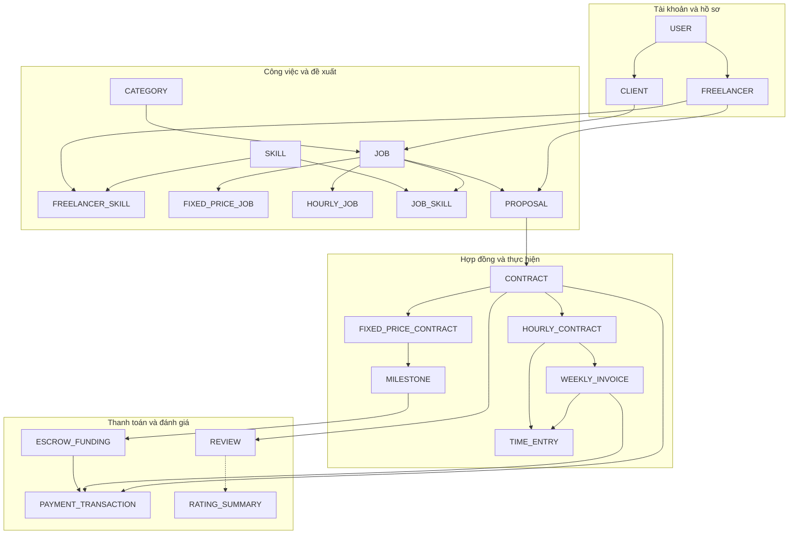
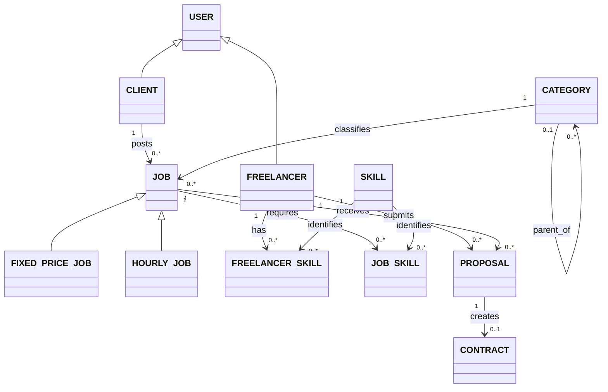
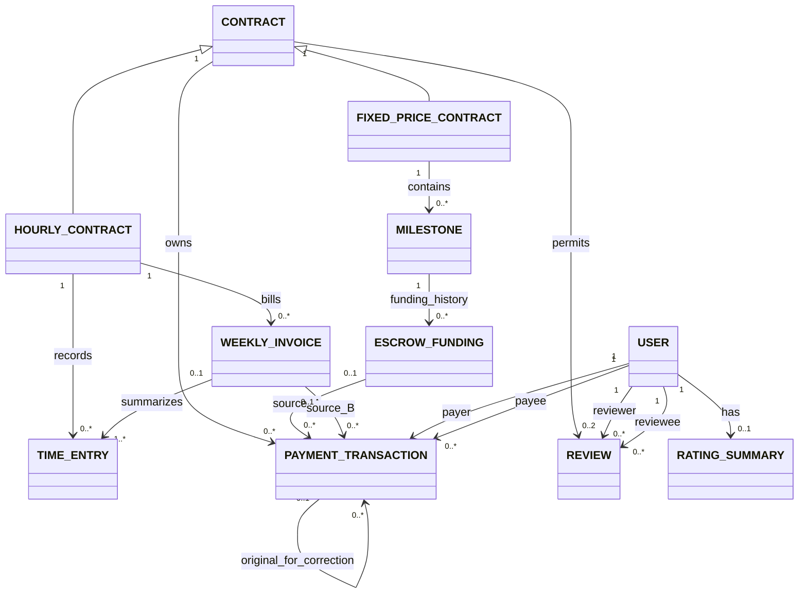

# Sơ đồ thiết kế khái niệm

[Trang chủ](../../README.md) · [Báo cáo gốc](../report/Project_Report_DB.docx)

Ba góc nhìn dưới đây được dựng lại từ danh mục thực thể, chuyên biệt hóa và bảng quan hệ ở mục 2.2–2.4 của báo cáo. Đây là bản diễn giải bằng Mermaid cho GitHub, không phải ảnh gốc của các Figure 2.1–2.3. File Word hiện có chú thích hình nhưng không chứa ảnh sơ đồ nhúng.

Các sơ đồ mô tả thiết kế dự kiến, chưa thể hiện lược đồ SQL hay kiến trúc phân tán đã triển khai.

## 1. Tổng quan các nhóm thực thể

Mũi tên tổng quan biểu thị liên hệ giữa các nhóm, không biểu thị lực lượng quan hệ hoặc thứ tự xử lý. Góc nhìn này không vẽ mọi quan hệ payer/payee và reviewer/reviewee để giữ dễ đọc.

## 2. Marketplace, kỹ năng và proposal

- USER → CLIENT/FREELANCER: **total, overlapping**; mỗi user có ít nhất một vai trò, có thể có cả hai.
- JOB → FIXED_PRICE_JOB/HOURLY_JOB: **total, disjoint**; mỗi job thuộc đúng một loại.
- JOB_SKILL được phép chưa có khi nháp; trước khi OPEN, job phải có ít nhất một kỹ năng yêu cầu.
- Mỗi cặp freelancer–job có tối đa một proposal; lần gửi lại dùng cùng vòng đời.
- Chỉ proposal ACCEPTED mới tạo hợp đồng. Mỗi job có tối đa một proposal được chấp nhận và một hợp đồng trong phạm vi đồ án.
- Không được ứng tuyển job của chính tài khoản mình.

## 3. Hợp đồng, công việc, thanh toán và đánh giá

- CONTRACT → FIXED_PRICE_CONTRACT/HOURLY_CONTRACT: **total, disjoint** và phải khớp loại job.
- Hợp đồng trọn gói phải có ít nhất một milestone trước ACTIVE; tổng số tiền milestone phải bằng agreed_amount.
- Hợp đồng theo giờ có time entry và invoice; mỗi time entry thuộc tối đa một invoice, mỗi invoice tổng hợp ít nhất một entry đủ điều kiện.
- **Diễn giải lịch sử escrow:** sơ đồ cho phép nhiều funding trong lịch sử; BR-30 giới hạn **tối đa một funding đang hoạt động** cho mỗi milestone. Chính sách tái cấp vốn cần được chốt ở bước thiết kế logic.
- **XOR nguồn thanh toán:** source_A và source_B là tùy chọn khi xét riêng; mỗi payment bắt buộc có đúng một nguồn. Nguồn phải thuộc cùng hợp đồng.
- Payer/payee phải là hai bên khác nhau của hợp đồng, phù hợp loại giao dịch. Giao dịch thành công chỉ được điều chỉnh bằng giao dịch bù liên kết bản gốc.
- Chỉ hợp đồng COMPLETED cho phép review; mỗi bên tối đa một review, điểm nguyên từ 1 đến 5.
- RATING_SUMMARY được suy ra từ các review hợp lệ nhận được.

## Cách đọc và cập nhật

Tam giác rỗng biểu thị kế thừa/chuyên biệt hóa. Các nhãn 1, 0..1, 0..* và 1..* biểu thị lực lượng quan hệ. Các ràng buộc total/disjoint/overlapping, XOR, trạng thái và tính duy nhất có điều kiện phải đọc cùng ghi chú; đường nối không tự thể hiện đầy đủ chúng.

Sửa trực tiếp các khối Mermaid trong file này khi mô hình được chốt lại. Chưa có số site, quy tắc phân mảnh hoặc cấu hình sao chép trong báo cáo nên repo chưa công bố sơ đồ triển khai phân tán.
